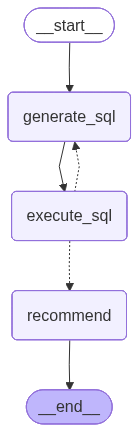

# Auto Parts Recommendation Agent

An LLM-powered auto parts advisor built with LangGraph. A customer describes their car problem in plain language, and the agent identifies relevant parts from an inventory database, then returns ranked recommendations with explanations. Supports multi-turn conversation, off-topic filtering, and real-time token streaming.

**Live Demo:** [golem-assignment.streamlit.app](https://golem-assignment.streamlit.app/)

## How It Works

```
User Question
    ↓
Resolve Query (classify intent + rewrite follow-ups into standalone questions)
    ↓
  off-topic? → respond and end
    ↓
Generate SQL (LLM reasons about the problem → writes SQL)
    ↓
Execute SQL (runs query against SQLite)
    ↓
  error? → retry SQL Generation (up to 3 attempts)
    ↓
Recommend (LLM ranks top 2-3 parts with explanations)
    ↓
Stream Response (real token streaming to UI)
```



The agent follows a Text-to-SQL pattern using LangGraph's StateGraph. A dedicated resolve_query node classifies user intent (auto-parts vs off-topic) and rewrites follow-up messages into standalone questions using conversation history. The SQL generation step then receives a clean question and uses automotive knowledge to reason about relevant product categories before writing SQL. A separate recommendation step takes the raw query results and produces a customer-facing response with ranked products and reasoning.

## Setup

### Prerequisites

- Python 3.11+
- [uv](https://docs.astral.sh/uv/) package manager
- OpenAI API key (default) or [Ollama](https://ollama.com/) for local models
- Google Cloud service account with Google Sheets API enabled

### Installation

```bash
git clone <repo-url>
cd golem-assignment

# Install dependencies
uv sync

# Set up environment variables
cp .env.example .env
# Edit .env and add:
#   OPENAI_API_KEY            — your OpenAI key
#   LLM_PROVIDER              — openai (default) or ollama
#   LLM_MODEL                 — gpt-4o (default) or any supported model
#   GOOGLE_SHEETS_CREDENTIALS_PATH — path to your service account JSON
#   GOOGLE_SHEET_ID           — the sheet ID from the Google Sheet URL
#   INVENTORY_DB_PATH         — inventory.db (default)
```

### Google Sheets Service Account Setup

1. Go to [Google Cloud Console](https://console.cloud.google.com/)
2. Create a project (or use an existing one)
3. Enable the **Google Sheets API**
4. Go to **IAM & Admin → Service Accounts** → Create a service account
5. Download the JSON key file and save it as `service_account.json` in the project root
6. Open the Google Sheet → **Share** → paste the service account `client_email` → set to **Viewer**

### Run

```bash
uv run streamlit run streamlit_app.py
```

The app syncs inventory from Google Sheets once on startup, then serves a Streamlit chat UI with sidebar conversation management.

### Switching LLMs

The LLM is configured via `LLM_PROVIDER` and `LLM_MODEL` in `.env`. Both chains (SQL generation and recommendation) share a single LLM instance defined in `graph/utils/llm.py`. To switch models, just update `.env`:

```bash
# OpenAI
LLM_PROVIDER=openai
LLM_MODEL=gpt-4o

# Ollama (local)
LLM_PROVIDER=ollama
LLM_MODEL=qwen3.5:2b
```

No code changes needed.

## Google Sheet

**View-only link:** `https://docs.google.com/spreadsheets/d/14nmGgKih11rhUxOprxWXeCIDY2GErNPAy022cOVhP48/edit?usp=sharing`

The product catalog (30 items) lives in a Google Sheet as the source of truth. The sheet has been shared with view-only access so you can inspect and copy it.

On startup, the app fetches the sheet data via the Google Sheets API using a service account, then loads it into a local SQLite database for querying. If you want to test with your own copy, make a copy of the sheet and update `GOOGLE_SHEET_ID` in `.env`. Share it with the service account email found in `service_account.json` under `client_email`.

## Project Structure

```
golem-assignment/
├── graph/
│   ├── chains/
│   │   ├── resolve_query.py      # LLM chain: classify intent + rewrite follow-ups
│   │   ├── generate_sql.py       # LLM chain: question + schema → SQL
│   │   ├── recommend_parts.py    # LLM chain: query results → ranked recommendations
│   │   └── stream_response.py    # LLM chain: recommendations → streamed plain text
│   ├── nodes/
│   │   ├── resolve.py            # Node: classifies intent, rewrites follow-ups
│   │   ├── generate.py           # Node: reads resolved question, calls generate_sql chain
│   │   ├── execute.py            # Node: runs SQL against SQLite (no LLM)
│   │   └── recommend.py          # Node: formats results, calls recommend chain
│   ├── utils/
│   │   ├── llm.py                    # Shared LLM instance (configurable via .env)
│   │   └── get_inventory_context.py  # Reads schema + sample rows at import time
│   ├── agent.py                  # Reusable graph runner with checkpointing
│   ├── consts.py                 # Node name constants
│   ├── graph.py                  # StateGraph wiring + conditional edges
│   └── state.py                  # Custom GraphState (TypedDict)
├── ingestion/
│   └── sync_catalog.py           # Google Sheets → SQLite sync
├── streamlit_app.py              # Streamlit UI with sidebar + streaming
├── chainlit_app.py               # Alternative Chainlit UI
├── main.py                       # CLI fallback
├── service_account.json          # Google service account credentials (gitignored)
└── pyproject.toml
```

## Design Decisions

### Q1) Why Google Sheets API with a Service Account

The assignment offered two ways to read from Google Sheets: a public CSV export or the Google Sheets API with a service account. I chose the service account approach because it keeps the sheet private. Only the service account email needs access, instead of exposing the inventory through a public CSV URL.

The tradeoff is a bit more setup, but it is closer to a real production workflow. In production, this approach also gives better control over access, credential rotation, and auditing.

- ### Sync Strategy

  The app re-syncs from Google Sheets on startup. This keeps the local SQLite database fresh at the beginning of each session without calling the Sheets API on every user query.

  For production, I would use a TTL-based refresh, such as re-syncing only if the cached data is older than 15 minutes, or a background sync job that updates inventory on a schedule.

### Q2) Why Separate Chains and Nodes

I separated chains from nodes to keep the code modular and easier to test. Chains define the LLM behavior, such as the prompt, model, and structured output. Nodes handle graph specific logic, such as reading state, passing inputs to chains, formatting SQL results, and returning state updates.

This keeps the LLM prompts reusable while keeping state management inside the graph nodes.

### Q3) Why Option A: LLM Generates Raw SQL

The assignment offered a few possible approaches. I chose Option A, where the LLM generates SQL directly from the user’s natural language question.

I considered Option B, where the LLM returns structured filters like category, keywords, or price range and the code builds the SQL. That is safer, but it limits the search to fields I define upfront. I also considered a hybrid approach (Option C) where one step extracts intent and another generates SQL, but that adds another node and LLM call.

For this project, Option A felt like the best tradeoff. Auto-parts questions can be vague, like “I’m doing a winter road trip from Boston to Montreal,” where the user may need batteries, wipers, antifreeze, or tires. Letting the LLM generate SQL directly allows it to reason from symptoms to relevant parts in one step, while LangGraph still handles the execution and retry flow around it.

- The SQLite connection is opened in **read-only mode** (`?mode=ro`), so the database itself rejects any write operation regardless of what SQL reaches it.
- The `execute_sql` node rejects any query that doesn't start with `SELECT`.
- Python's `sqlite3.cursor.execute()` only runs a single statement per call, blocking multi-statement injection like `SELECT ...; DROP TABLE ...`.
- The system prompt explicitly instructs the LLM: "SELECT only. Never INSERT, UPDATE, DELETE, DROP, or ALTER."
- **In production**, I would additionally add: a SQL parser/validator to structurally verify queries before execution, and query parameterization where possible.

### Q4) Why Custom State with Messages

I used a custom `TypedDict` because the graph passes structured data between nodes — SQL strings, error messages, query result rows, retry counts, and recommendations. These are not naturally chat messages, so `MessagesState` alone would force wrapping structured values inside message objects.

However, the state also includes a `messages` field with `add_messages` reducer for multi-turn conversation history. This gives the best of both worlds: explicit structured fields for the pipeline, and an append-only message list for conversation memory.

### Q5) Why a Resolve Query Node

Early versions passed conversation history directly to the SQL generation LLM. This caused two problems: the SQL LLM would anchor on previously recommended product names instead of re-deriving categories, and off-topic questions would force SQL generation (because `with_structured_output` requires a SQL string output).

The resolve_query node separates these concerns. It classifies intent (auto-parts vs off-topic), rewrites follow-ups into standalone questions using the previous resolved question as context, and routes off-topic queries directly to END without any SQL generation. The SQL LLM now receives a clean, standalone question every time and only needs to focus on generating good SQL.

### Q6) Why No Tools / @tool Decorator

Tools are useful when the LLM needs to choose an action at runtime, such as listing tables, fetching a schema, or running a query. In this project, there is only one known inventory table, and its schema is already included in the prompt.

Because the workflow is fixed, I let LangGraph control the execution through explicit edges instead of relying on LLM tool-calling decisions. The `execute_sql` step is plain Python logic inside a graph node, not a separate tool.

### Q7) Wide Net SQL Strategy

The SQL generation prompt instructs the LLM to use OR across multiple text columns and to skip LIMIT. It also teaches the LLM to separate product-relevance terms from constraints — product categories go in a grouped OR block, and constraints like vehicle type go in a separate AND block. The recommendation step then narrows down to the top 2-3 products.

### Q8) Multi-Turn Conversation

The graph uses LangGraph's `SqliteSaver` checkpointer to persist state across invocations. Each Streamlit chat session gets a unique `thread_id` (UUID), so conversations don't mix. The `messages` field in state uses `add_messages` reducer to accumulate conversation history.

The resolve_query node uses the `previous_resolved_question` from state to maintain context across turns. When a user says "I have a sedan" after asking about a winter road trip, the resolver merges these into a single standalone question rather than treating "I have a sedan" in isolation.

To prevent anchoring on previously recommended products, only a compact summary (not the full detailed output) is stored in conversation messages.

### Q9) Token Streaming

The recommendation chain uses `with_structured_output` to return a Pydantic model with typed fields like `stock_status`, `parts`, and `summary`. This enables programmatic edge case handling — for example, detecting out-of-stock products by checking `part.stock_status` in code rather than parsing free text. However, structured output blocks token streaming because the full Pydantic object must be assembled before parsing.

To achieve real streaming without losing structured output benefits, a second plain-text chain (`stream_response_chain`) takes the structured recommendation and streams it to the Streamlit UI token by token. The structured chain handles logic, the streaming chain handles presentation. The tradeoff is one extra LLM call per request, but the user sees a responsive, ChatGPT-like experience while the system retains programmatic access to recommendation data.

### Q10) Why Streamlit Over Chainlit

Both UIs were implemented. Streamlit was chosen as the primary interface because it provides sidebar conversation management, new chat support, and conversation switching with pure Python — no Docker, Postgres, or authentication setup required. Chainlit's sidebar features require a data persistence layer and auth, which adds infrastructure complexity that I plan to explore as a future enhancement.

## Edge Cases

### 1) Out of Stock

SQL intentionally does not filter on `stock_quantity`. Out-of-stock items are still passed to the recommendation chain because the best technical match may not always be available. The response flags those items clearly and suggests in-stock alternatives when possible.

Because the recommendation chain returns structured output with a `stock_status` field, a production backend could also use that field programmatically, for example to show an out-of-stock badge, trigger reorder alerts, or suggest substitutes without parsing free text.

### 2) Off-Topic Queries

The resolve_query node classifies user intent before any SQL is generated. Off-topic questions like "What's the weather?" are routed directly to END with a hardcoded response, bypassing SQL generation and recommendation entirely. This saves two LLM calls compared to letting the query flow through the full pipeline.

Questions about preparing for trips, weather conditions, or driving situations are treated as auto-parts related even if they don't explicitly mention auto parts.

### 3) SQL Errors / Retry Loop

If the generated SQL fails to execute (syntax error, wrong column name), the error message is passed back to the `generate_sql` node via state. The LLM sees the error and fixes its SQL. This retries up to 3 times before giving up and routing to the recommendation step with empty results. A `try/except` around the LLM call also catches token limit errors, preventing app crashes.

### 4) Follow-Up Narrowing

When a user provides additional context like vehicle type, the resolve_query node merges it with the original need into a standalone question. The SQL generation prompt then instructs the LLM to treat vehicle type as a constraint (AND filter) rather than a search term (OR), and to preserve the full breadth of the original product search.

## What I'd Do Differently With More Time

- **Cleaner follow-up handling** — The resolve_query node currently sees the previous resolved question, conversation history, and the new message all at once. Sometimes the conversation history (which contains product names) pulls the LLM's attention away from the clean resolved question. A better design would only show the previous resolved question and the new message for most follow-ups, and only look at conversation history when the user explicitly references a previous recommendation (like "the second option").

- **SQL validation** — Use `sqlglot` to parse and validate SQL structurally before execution, catching more issues than the `startswith("SELECT")` check.

- **Structured logging** — Replace `print` statements with proper logging for production traceability.

- **Tests** — Unit tests for each chain in isolation, integration tests for the full graph with known queries and expected results.

- **Persistent sidebar** — LangGraph conversations are already persisted on disk via SQLite, but the Streamlit sidebar conversation list lives in `st.session_state` (in-memory) and resets on app restart. The conversations still exist, but the sidebar just doesn't know which thread IDs to display. A fix would be storing sidebar metadata (thread ID → title mapping) in a small SQLite table so the UI can rebuild the list after a restart. However, on Streamlit Cloud the filesystem is ephemeral both conversation DB and metadata file reset on redeploy. A proper fix would require an external database, which adds infrastructure beyond what's needed for this demo.

## Walkthrough

### How it works

The user types a question in the Streamlit chat UI. The resolve_query node classifies the intent and rewrites follow-ups into standalone questions. The SQL generation LLM reads the table schema (loaded once at startup) and uses automotive knowledge to expand the question into relevant product categories, writing SQL with OR clauses across multiple columns. Vehicle type and other constraints are applied as AND filters. The SQL runs against a read-only SQLite connection. If it fails, the error goes back to the LLM for a fix (up to 3 retries). On success, the raw product rows are formatted and passed to a recommendation LLM that ranks the top 2-3 products with automotive reasoning. Finally, a streaming chain re-presents the recommendation with real token streaming to the UI.

### One thing I'm proud of

The resolve_query → generate_sql separation. This was the hardest part of the project. Early versions tried to make one LLM call handle both conversation context and SQL generation. I went through multiple iterations: merging human messages, passing full history, human only history, prompt rule after prompt rule and each fix broke something else. The SQL LLM would anchor on previously recommended product names, or collapse broad searches into literal keyword matches, or mix off topic questions into auto parts queries. The breakthrough was realizing these are two fundamentally different jobs: understanding what the user wants vs writing SQL to find it. Splitting them into separate nodes, with the resolver using the previous resolved question as its primary context, finally made follow-ups work consistently.

### One thing I'd change

I would save the product categories that the SQL LLM searches for (like tires, batteries, wipers, antifreeze) in a state field after the first query. Right now, those categories only exist inside a single LLM call and aren't stored anywhere. On follow-up turns, the LLM has to re-figure-out which categories are relevant from the rewritten question, and sometimes it drops some. If the categories were saved in state, the next turn could just add the new constraint (like sedan) on top of the known category list instead of re-deriving everything from scratch.
